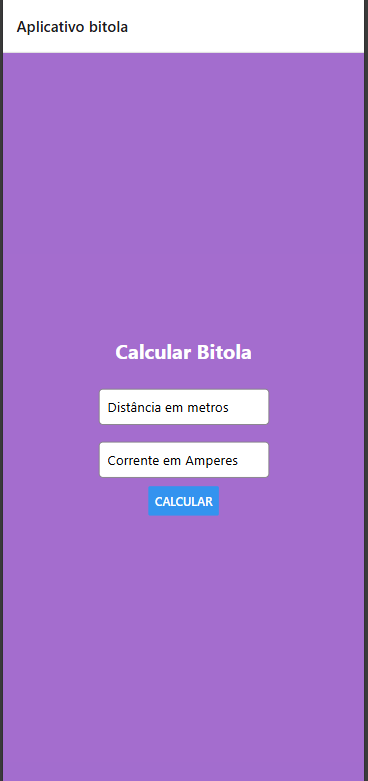

# Bitola

Projeto [Expo](https://expo.dev) criado com [`create-expo-app`](https://www.npmjs.com/package/create-expo-app) para estudar React Native

## Como executar

1. Instale as dependencias

   ```bash
   npm install
   ```

2. Inicie o app

   ```bash
   npx expo start
   ```
# ScreenShot


- O expo pode ser instalado globalmente com o seguinte comando:
```bash
npm install -g expo-cli
```
- 4 Execute o comando para criar um novo projeto React Native:
```bash
npx create-expo-app@latest NomeDoSeuProjeto
```
 - 5 Após a criação do projeto, navegue até a pasta do projeto:
```bash
cd NomeDoSeuProjeto
```
- 6 Para executar o projeto, execute o comando:
```bash
npm start
```
- 7 Pode ser necessario instalar dependências adicionais para o React Native Web:
```bash
npm install -g expo-cli
npm install react-native-web --force
npm install react-dom -force
npx expo install @expo/metro-runtime
```
- 8 Para redefinir/limpar o projeto, execute o comando:
```bash
npm run reset-project
```